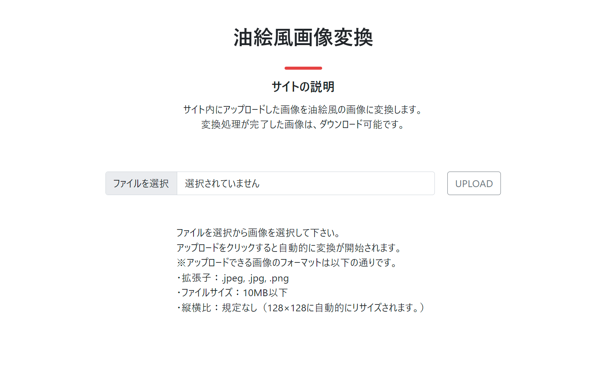
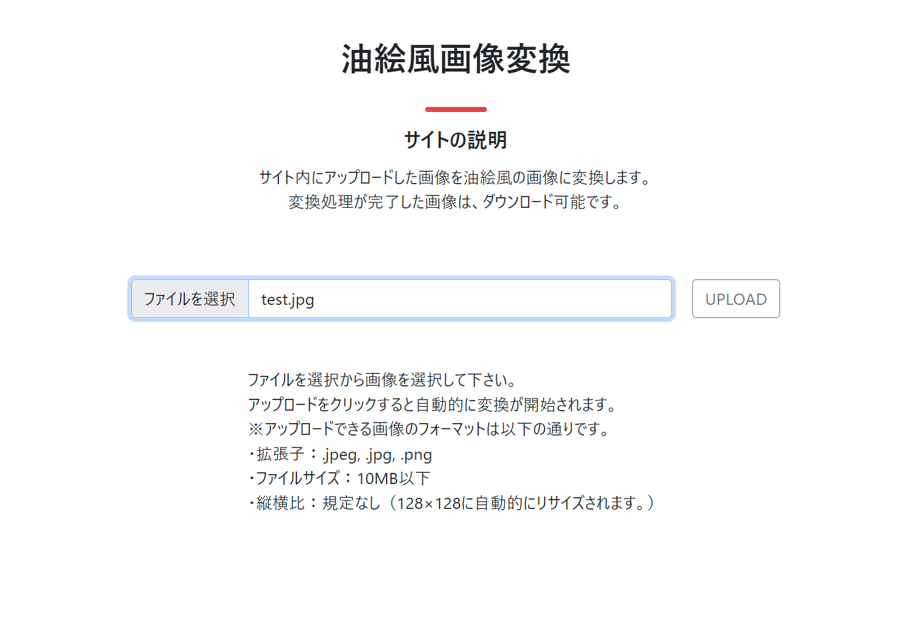
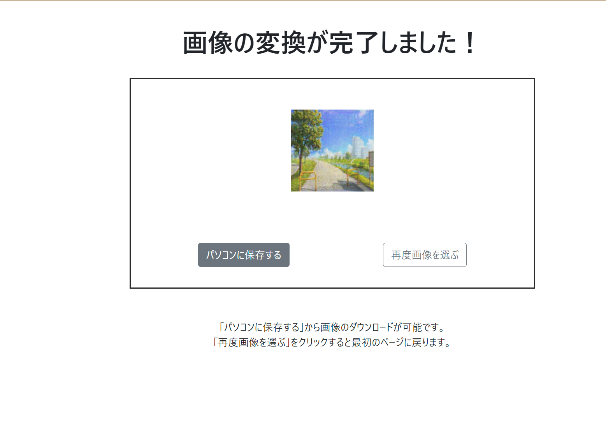

# Springboot

油絵風に画像変換処理をしてくれるwebサイトです。

## 実装方法

### 1. Springbootフォルダのダウンロード
-  「Springboot」 フォルダをダウンロードします。

### 2. cycleganのダウンロード
- (https://github.com/soda143/cyclegan) から 「cyclegan」をダウンロードします。
  - **注**: 「cyclegan」の実装方法は上記のURLで確認してください。
  - 学習済みモデル「oil_painting_weights.h5」を使用することで、油絵風に画像を変換します。

### 3. パスの設定
ダウンロードした 「Springboot」 フォルダ内の以下のファイルを編集して、コードにパスを追加します。

- **PictConvConst.java**: `Springboot\src\main\java\com\samurai\pictconverter\PictConvConst.java`
  ```java
  public static final String beforeDir = "「cyclegan」フォルダ内、「original_image」フォルダ直下までの絶対パス";  // アップロードされた画像が保存されるパス
  public static final String afterDir = "「cyclegan」フォルダ内、「result」フォルダ直下までの絶対パス";  // pythonで変換した画像が保存されるパス
　
- **PictConvTopServiceImpl.java**: `Springboot\src\main\java\com\samurai\pictconverter\service\PictConvTopServiceImpl.java`

```java
 String scriptPath = "「cyclegan」フォルダ内、「cyclegan_test.py」までの絶対パス";
```

### 4. アプリケーションの実行
- `Springboot\src\main\java\com\samurai\pictconverter\PictConverterApplication.java` を実行します。

### 5. Webアクセス
- ブラウザを起動して、[http://localhost:8080/top](http://localhost:8080/top) にアクセスします。

## 使用方法

### 1.
[http://localhost:8080/top](http://localhost:8080/top)にて、「ファイルを選択」をクリックします。



### 2.
ローカル内の画像を選択します。
試しに以下の画像を選択してみます。


### 3.
アップロードをクリックします。



### 4.
画像の変換が完了後、画面が遷移、変換後の画像が表示されます。




